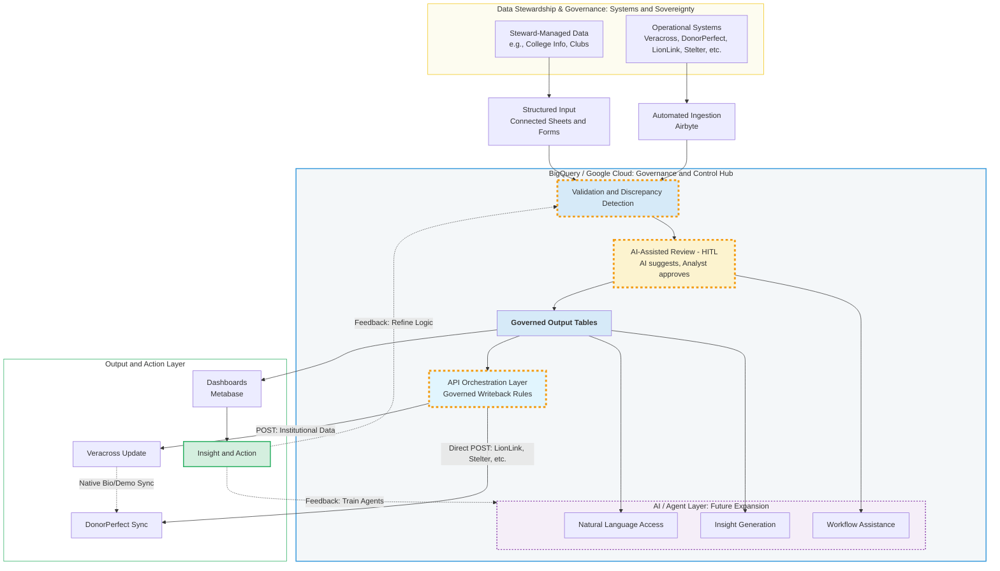

# Philanthropy Data Architecture & AI-First Strategy

## Executive Summary
This repository houses the orchestration logic, data schemas, and governance rules for our institutional advancement data. Our goal is to move from manual data entry to a **Control Tower** model—where data is validated in Google Cloud, enriched by AI, and synchronized back to our core systems (Veracross and DonorPerfect) with 100% integrity.

---

## 🏗 The Architecture
The following diagram illustrates our end-to-end data flow. Note the **Double-Layer Governance**: Stewardship at the source and Automated Rules at the core.

# Governance Pillars

## Governance at the Source (Stewardship)
Data quality begins with the people who own the systems.

* **Accuracy:** Stewards are responsible for the validity of data entered into LionLink, Stelter, and Veracross.
* **Timeliness:** Data entry must be completed by weekly deadlines to ensure ingestion accuracy.
* **Sovereignty:** Departments maintain ownership of their data while adhering to institutional standards for formatting and definitions.

---

## Governance at the Core (BigQuery)
Our "Control Tower" acts as a filter, not just a pipe.

* **Validation (The Orange Box):** Automated scripts flag discrepancies (e.g., mismatched IDs, invalid dates).
* **HITL (Human-in-the-Loop):** The Philanthropy Analyst reviews AI-suggested corrections. No "Writeback" happens without human oversight.
* **Rule-Based Writeback:** Our API Orchestration Layer follows strict rules to ensure we do not overwrite "Primary" registrar data with "Secondary" engagement data (e.g., LionLink/Stelter).

---

## Future Vision: AI & Agents
Our architecture is built for the next phase of Advancement:

* **Natural Language Access:** Fundraisers will be able to ask *"Who in New York is overdue for a visit?"* and get an answer derived directly from our Governed Output Tables.
* **Proactive Insights:** AI agents will identify patterns in giving before they become obvious in standard reporting.
