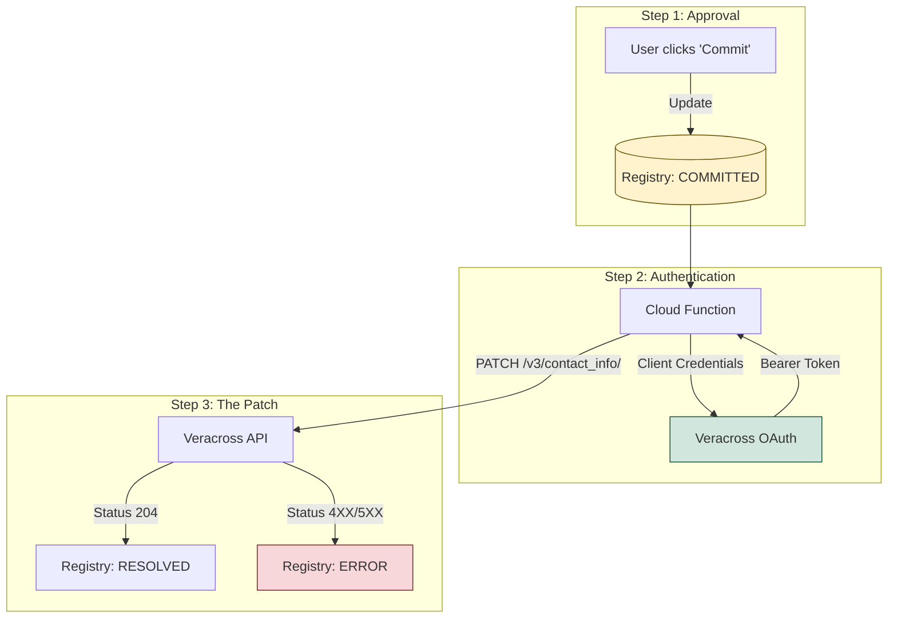
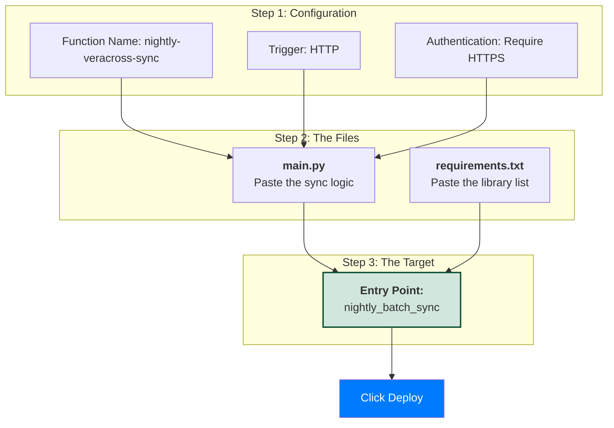

# Cloud Function to PATCH to Veracross


## Deploying the Cloud Function

## Create OAuth Applicaton in Veracross to enable API access add needed scopes
- households:read
- persons:read
- contact_info:update (required for the PATCH request)
  
## Cloud function main.py
This script follows the Client Credentials Flow to get a bearer token before looping through your BigQuery "Committed" queue.
```Python
import requests
import json
from google.cloud import bigquery

# Configuration (Best practice: Load these from Secret Manager)
SCHOOL_ROUTE = "your_school_slug"
CLIENT_ID = "your_client_id"
CLIENT_SECRET = "your_client_secret"
REVISION = "2023-01-01" # Replace with current Veracross API revision

def get_access_token():
    """Step 1: The Handshake"""
    auth_url = f"https://accounts.veracross.com/{SCHOOL_ROUTE}/oauth/token"
    data = {
        'grant_type': 'client_credentials',
        'scope': 'contact_info:update'
    }
    response = requests.post(auth_url, data=data, auth=(CLIENT_ID, CLIENT_SECRET))
    return response.json().get('access_token')

def nightly_batch_sync(event, context):
    token = get_access_token()
    client = bigquery.Client()
    
    # Fetch records approved by humans in Metabase
    query = "SELECT * FROM `governance.discrepancy_registry` WHERE status = 'COMMITTED'"
    rows = client.query(query).result()

    headers = {
        "Authorization": f"Bearer {token}",
        "Content-Type": "application/json",
        "X-API-Revision": REVISION
    }

    for row in rows:
        # Step 2: Format the PATCH per Veracross V3 docs
        url = f"https://api.veracross.com/{SCHOOL_ROUTE}/v3/contact_info/{row.entity_id}"
        
        # We wrap the update in the "data" object as required
        payload = {
            "data": {
                row.field_name: row.expected_value
            }
        }

        try:
            res = requests.patch(url, headers=headers, json=payload)
            
            if res.status_code == 204: # Veracross returns 204 for successful PATCH
                status, msg = 'RESOLVED', None
            else:
                status, msg = 'ERROR', res.text[:200]
                
        except Exception as e:
            status, msg = 'ERROR', str(e)

        # Step 3: Write the result back to the Registry
        update_bq_status(row.discrepancy_id, status, msg)
```

