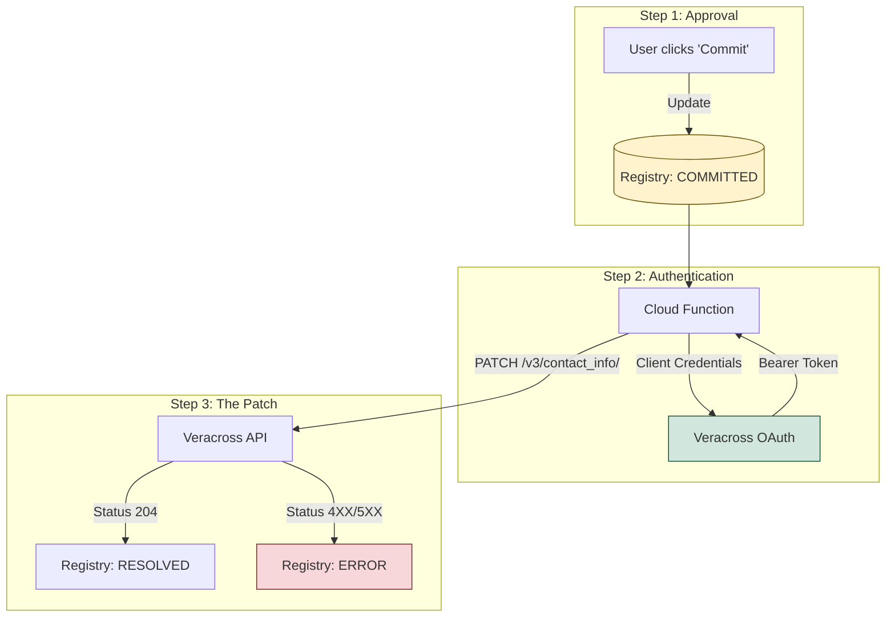

# Cloud Function to PATCH to Veracross


## Deploying the Cloud Function
```mermaid
graph TD
    subgraph Setup [Step 1: Configuration]
        A[Function Name: nightly-veracross-sync]
        B[Trigger: HTTP]
        C[Authentication: Require HTTPS]
    end

    subgraph Code [Step 2: The Files]
        D[<b>main.py</b><br/>Paste the sync logic]
        E[<b>requirements.txt</b><br/>Paste the library list]
    end

    subgraph Entry [Step 3: The Target]
        F["<b>Entry Point:</b><br/>nightly_batch_sync"]
    end

    A & B & C --> D
    D & E --> F
    F --> G[Click Deploy]

    style F fill:#d1e7dd,stroke:#0f5132,stroke-width:2px
    style G fill:#007bff,color:#fff
