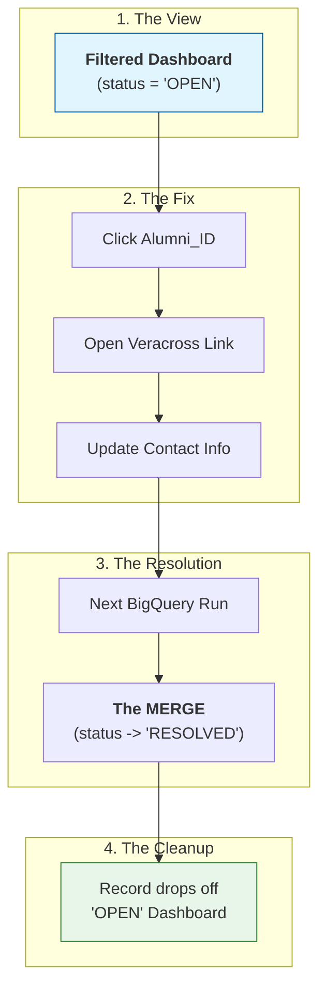
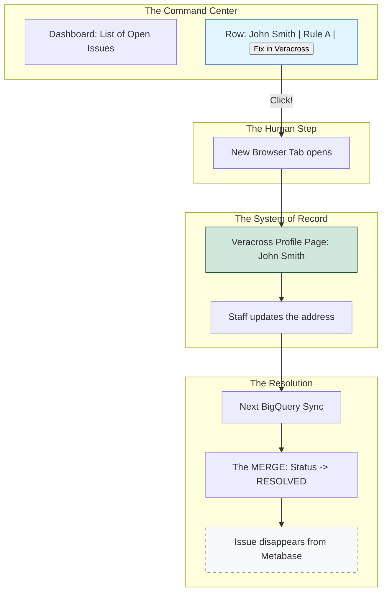

# Discrepancy Resolution in Metabase

## Why this is better than a simple "Mismatch" report:
Zero Manual Deletion: Your team never has to "delete" an error from Metabase. They just fix the data in Veracross, and the next time the BigQuery pipeline runs (usually overnight or every hour), the "Merge" sees the fix and moves the status to RESOLVED.

### Focus: You can create "Tabs" in Metabase:
- Tab 1: High Priority (Lion Link updates for Major Donors).
- Tab 2: Technical Debt (Veracross vs. Donor Perfect API mismatches).
- Tab 3: History (Everything that was resolved this month).

Accountability: If a record stays OPEN for 30 days, you can see exactly when it first appeared (first_detected_at) and ask why it hasn't been handled.


## Adding the one-click layer in Metabase
Instead of the team having to copy an ID, open Veracross, and search for the alum, they can just click the ID in your dashboard and jump straight to the record.

### 1. The SQL "Deep Link" Logic
First, you need to find the URL structure Veracross uses for a person's profile. It usually looks something like this: https://accounts.veracross.com/[your_school_shortname]/portals/records/[alumni_id].

You add this as a virtual column in your Layer 4 View:
``SQL
CREATE OR REPLACE VIEW `your_project.governance.vw_metabase_action_queue` AS
SELECT
  alumni_id,
  first_name,
  last_name,
  rule_name,
  -- Generate the URL string
  CONCAT('https://accounts.veracross.com/your_school/portals/records/', alumni_id) AS veracross_profile_url,
  status
FROM `your_project.governance.discrepancy_registry`
WHERE status = 'OPEN';
```
### . Setting it up in Metabase
Metabase allows you to turn that text string into a clickable button.
- Open your Question (Table) in Metabase.
- Click on the Settings (gear icon) for the veracross_profile_url column.
- Under Display, change the View as setting to Link.

You can even change the Link text to something cleaner like "Open in Veracross ↗".



## Why this is a "Governance" Power Move:
- Reduced Friction: You’ve removed the 30 seconds of "searching" for every record. If you have 200 discrepancies, you just saved your team nearly 2 hours of admin work.
- Data Integrity: Because the link is built from the alumni_id, there is zero risk of the staff member accidentally updating the wrong "John Smith." The ID forces them to the exact right record.
- Training: It makes the tool so easy to use that even non-technical staff can "own" the data cleanup process.

