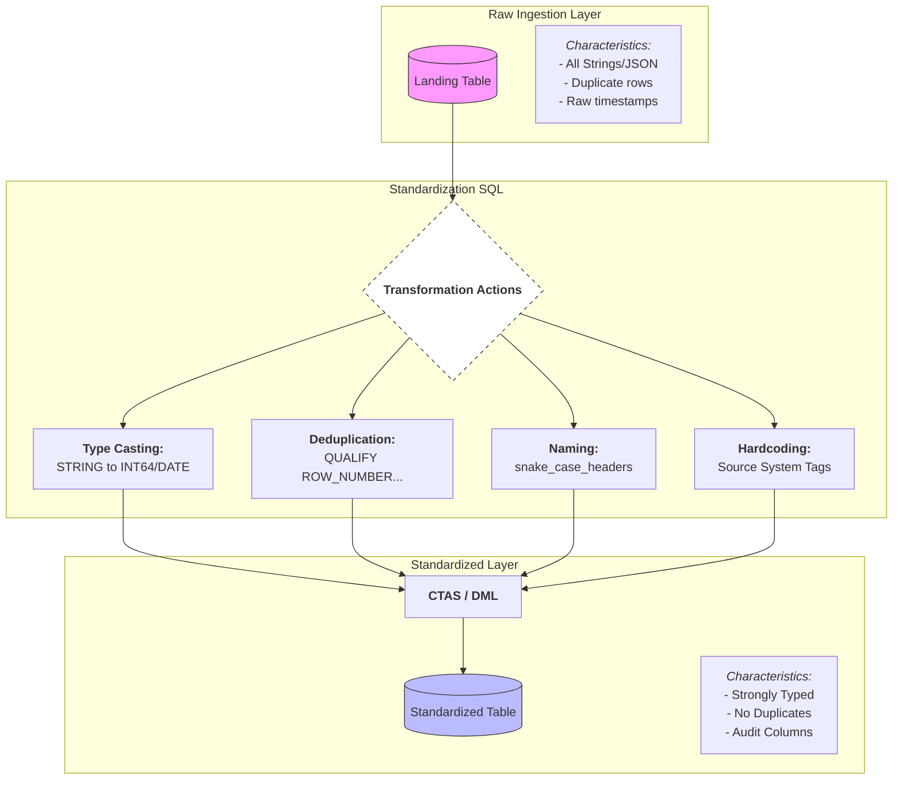

# Layer 1: The Transformation Flow (Portrait)
### In BigQuery, this is where you convert Raw Ingestion Tables (often JSON, CSV, or external streams) into Standardized Tables.

## What happens inside the SQL?
Here is an example of what that Standardization SQL actually does to a "Customer" record. Notice how it takes "garbage" and creates "truth."

SQL
CREATE OR REPLACE TABLE `project.std_dataset.customers` AS
SELECT
  -- 1. Identity & Deduplication logic
  TRIM(CAST(cust_id AS STRING)) AS customer_id,
  
  -- 2. Type Casting (The most important part)
  SAFE_CAST(signup_date AS DATE) AS signup_date,
  SAFE_CAST(total_spend AS FLOAT64) AS total_spend_amount,
  
  -- 3. Cleaning Strings
  UPPER(TRIM(country_code)) AS country_code,
  COALESCE(email, 'unknown') AS email_address,
  
  -- 4. Audit Columns (Essential for Governance)
  'CRM_SYSTEM_ALPHA' AS source_system,
  CURRENT_TIMESTAMP() AS _standardized_at
FROM `project.raw_dataset.crm_export_raw`
-- 5. Filter out completely broken records early
WHERE cust_id IS NOT NULL;

## Why this matters for the Pipeline
- Uniformity: If you have data from three different regions, Layer 1 makes sure DATE is always YYYY-MM-DD before you try to match them in Layer 2.
- Performance: By casting to proper types (like INT64 or DATE), BigQuery processes the data significantly faster and cheaper than if it were all STRING.
- Governance Start: This is where you first define what "valid" data looks like. If it can't be cast to a DATE here, it's already a candidate for a discrepancy.
