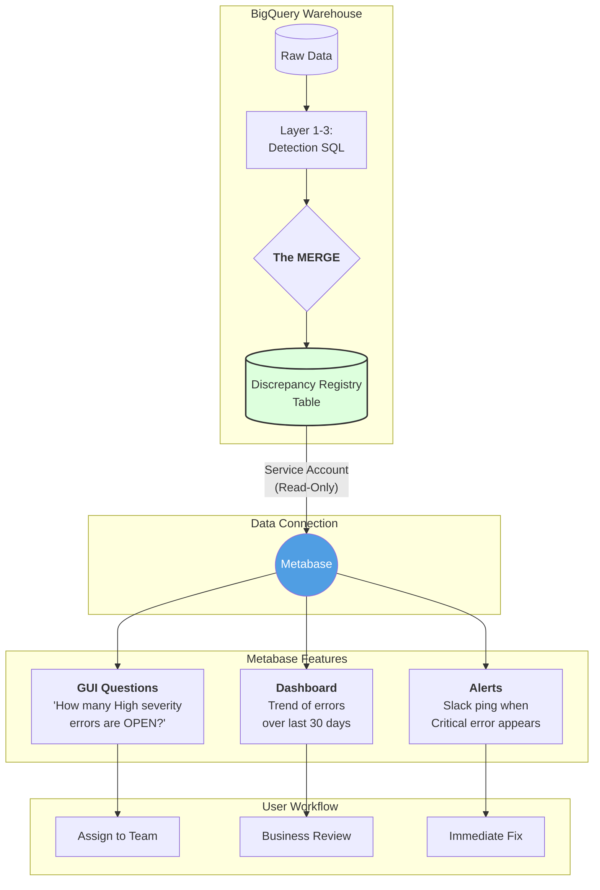

```mermaid
graph TD
    subgraph Detection [Layer 3: Detection]
        RuleA[Rule Logic A]
        RuleB[Rule Logic B]
    end

    subgraph Logic [The Worker]
        M{<b>The MERGE Code</b><br/>Logic Layer}
    end

    subgraph Storage [The Bucket]
        T[(<b>Discrepancy Registry</b><br/>Table Schema)]
    end

    subgraph Viz [The Lens]
        Meta[[<b>Metabase</b>]]
    end

    RuleA --> M
    RuleB --> M
    M -- "Updates or Inserts" --> T
    T -- "Displays Data" --> Meta

    style M fill:#f9f,stroke:#333
    style T fill:#bbf,stroke:#333
    style Meta fill:#509ee3,color:#fff
