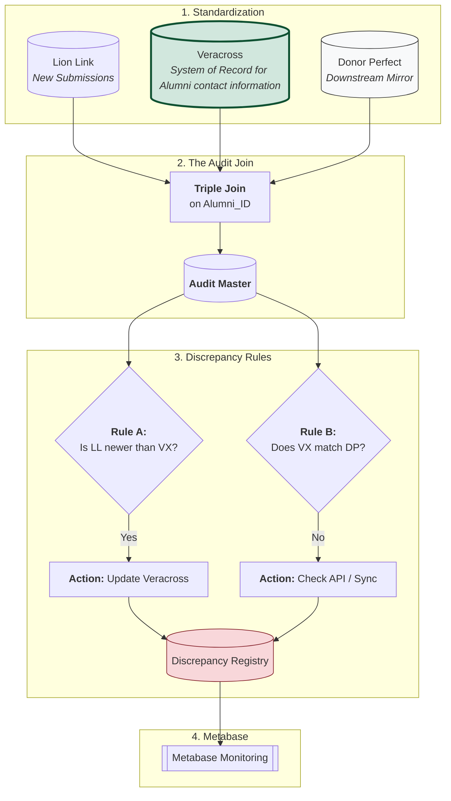
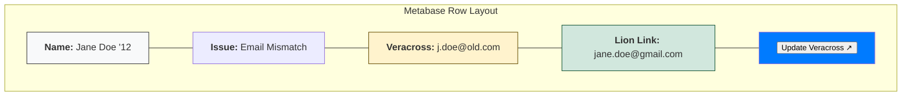

# Source of Truth Governance
By separating these Rules A and B, you can tell exactly where the human or the machine is failing. If you see a lot of "Failure Mode 2," you know your API is broken. If you see "Failure Mode 1," you know your office staff needs to process the Lion Link queue faster.

If Advancement is contacted by an Alum with and update to contact information, that information is entered into VERACROSS.

## Failure Mode 1: The "Input Gap" (Lion Link → Veracross)
Logic: IF LL_Update_TS > VX_Update_TS AND LL_Address != VX_Address
- Meaning: An alum updated their info in Lion Link, but it hasn't been manually or automatically moved into Veracross yet.
- Metabase Alert: "New Alumni Data Pending in Veracross."

## Failure Mode 2: The "Sync Gap" (Veracross → Donor Perfect)
Logic: IF VX_Address != DP_Address
- Meaning: Veracross has the correct info, but the API failed to push it to Donor Perfect, or the sync is delayed.
- Metabase Alert: "API Sync Error: Donor Perfect is out of sync with Veracross."


# Sample Code for Failure Mode 2/Rule B

```SQL
SELECT 
  alumni_id,
  'API_SYNC_ERROR' AS rule_id,
  'Veracross vs Donor Perfect Mismatch' AS rule_name,
  'Donor Perfect' AS system_to_fix,
  vx_email AS expected_value,
  dp_email AS actual_value,
  'High' AS severity
FROM `project.conformed.audit_master`
WHERE vx_email != dp_email;
```

# Sample Code for joining descrepancy table back to standardized alum table to make updates easy!
This view flattens the logic so a Metabase user can filter by system_to_fix or severity.
```SQL
CREATE OR REPLACE VIEW `your_project.governance.vw_metabase_action_queue` AS
SELECT
  -- Who is it?
  a.first_name,
  a.last_name,
  a.class_year,
  
  -- What is the conflict?
  d.rule_name,
  
  -- The "Side-by-Side" (The Context)
  d.actual_value AS current_in_veracross,
  d.expected_value AS new_from_lion_link,
  
  -- The "Fix It" Button
  CONCAT('https://accounts.veracross.com/your_school/portals/records/', a.alumni_id) AS fix_in_veracross,
  
  -- Metadata
  d.first_detected_at,
  d.severity
FROM `your_project.governance.discrepancy_registry` d
JOIN `your_project.std_dataset.alumni_master` a 
  ON d.entity_id = a.alumni_id
WHERE d.status = 'OPEN';
```
## How it looks in Metabase

## We can also create an API Verification View
You can create a second tab in Metabase specifically for the Veracross vs. Donor Perfect sync. This one is for your technical team:
- Column A: Veracross Value (The Truth)
- Column B: Donor Perfect Value (The Mirror)

The Goal: These should match 100% of the time. If they don't, it's an API bug, not a human data entry error.

### Why this is "Cool" for your Team:
- Confidence: The staff member doesn't have to guess if they are making the right change. They see the evidence right there.
- Speed: They can keep Metabase open on one half of their screen and Veracross on the other. Click link → Copy New Value → Paste in Veracross → Save. * Verification: Once they save in Veracross, they know that tomorrow morning, that row will be gone from their list.
