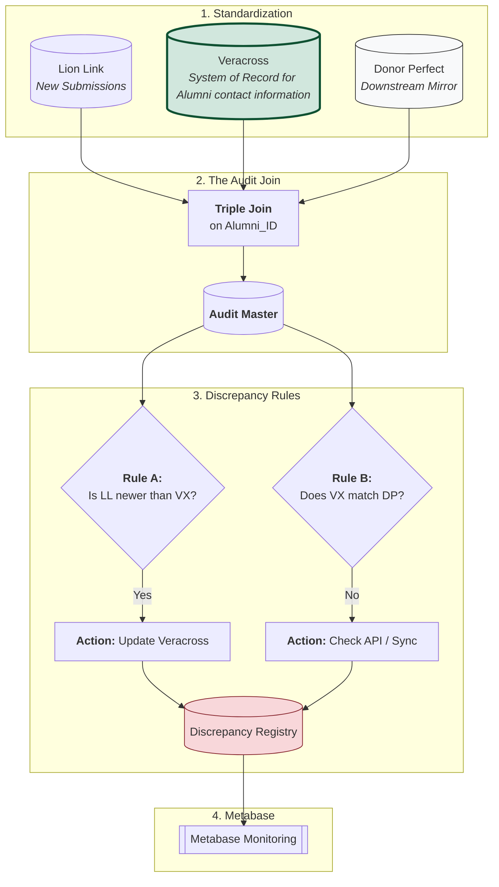
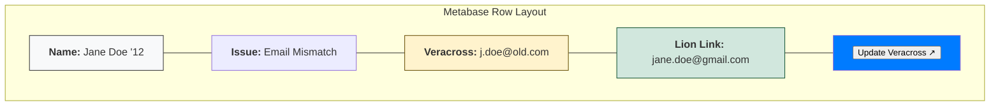
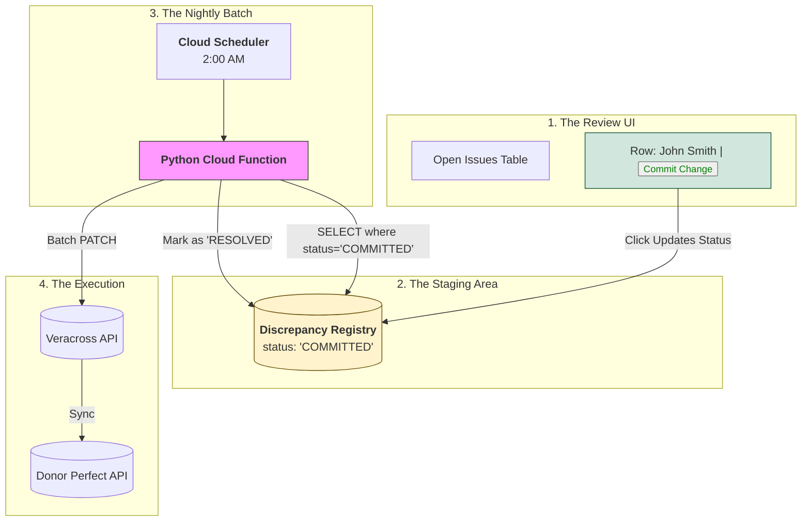
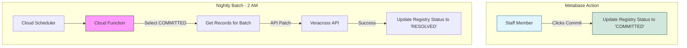
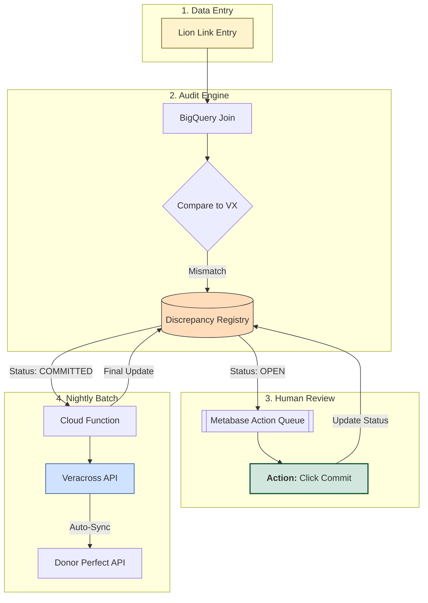
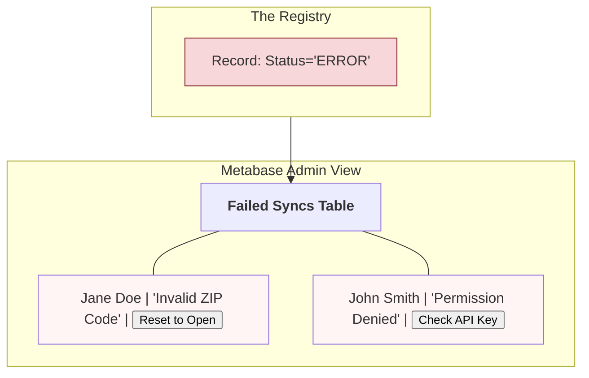

# Source of Truth Governance
By separating these Rules A and B, you can tell exactly where the human or the machine is failing. If you see a lot of "Failure Mode 2," you know your API is broken. If you see "Failure Mode 1," you know your office staff needs to process the Lion Link queue faster.

If Advancement is contacted by an Alum with and update to contact information, that information is entered into VERACROSS.

## Failure Mode 1: The "Input Gap" (Lion Link → Veracross)
Logic: IF LL_Update_TS > VX_Update_TS AND LL_Address != VX_Address
- Meaning: An alum updated their info in Lion Link, but it hasn't been manually or automatically moved into Veracross yet.
- Metabase Alert: "New Alumni Data Pending in Veracross."

## Failure Mode 2: The "Sync Gap" (Veracross → Donor Perfect)
Logic: IF VX_Address != DP_Address
- Meaning: Veracross has the correct info, but the API failed to push it to Donor Perfect, or the sync is delayed.
- Metabase Alert: "API Sync Error: Donor Perfect is out of sync with Veracross."


# Sample Code for Failure Mode 2/Rule B

```SQL
SELECT 
  alumni_id,
  'API_SYNC_ERROR' AS rule_id,
  'Veracross vs Donor Perfect Mismatch' AS rule_name,
  'Donor Perfect' AS system_to_fix,
  vx_email AS expected_value,
  dp_email AS actual_value,
  'High' AS severity
FROM `project.conformed.audit_master`
WHERE vx_email != dp_email;
```

# Sample Code for creating discrepancy table
This view flattens the logic so a Metabase user can filter by system_to_fix or severity. This view also incude support for the "commit workflow" where changes are batch applied by Cloud Run function overnight
```SQL
CREATE OR REPLACE TABLE `your_project.governance.discrepancy_registry` (
  -- 1. Unique Identifiers
  discrepancy_id STRING DEFAULT GENERATE_UUID(), -- Unique key for the error itself
  entity_id STRING NOT NULL,                      -- The Alumni_ID
  rule_id STRING NOT NULL,                        -- e.g., 'RULE_A' (LL vs VX) or 'RULE_B' (VX vs DP)
  
  -- 2. The Data Conflict
  field_name STRING,                              -- e.g., 'email', 'phone', 'home_address'
  actual_value STRING,                            -- What is currently in Veracross
  expected_value STRING,                          -- What Lion Link says it should be
  
  -- 3. The Lifecycle (The "State Machine")
  status STRING DEFAULT 'OPEN',                   -- OPEN, COMMITTED, RESOLVED, or ERROR
  severity STRING,                                -- LOW, MEDIUM, HIGH, CRITICAL
  
  -- 4. Audit & Tracking
  first_detected_at TIMESTAMP DEFAULT CURRENT_TIMESTAMP(),
  last_seen_at TIMESTAMP DEFAULT CURRENT_TIMESTAMP(),
  occurrence_count INT64 DEFAULT 1,
  
  -- 5. Human Approval (Layer 3)
  committed_by STRING,                            -- Email of the staff member who clicked 'Commit'
  committed_at TIMESTAMP,
  
  -- 6. API Feedback (Layer 4)
  last_sync_attempt TIMESTAMP,
  retry_count INT64 DEFAULT 0,
  last_error_message STRING                       -- Human-readable error from Veracross API
)
CLUSTER BY status, rule_id; -- Optimized for Metabase and the Cloud Function
```

### Discrepancy Registry: Table Schema

| Column Name | Data Type | Key/Null | Description |
| :--- | :--- | :--- | :--- |
| **discrepancy_id** | `STRING` | `DEFAULT UUID` | Primary Key: Unique ID for this specific error instance. |
| **entity_id** | `STRING` | `NOT NULL` | The **Alumni_ID** (links to Veracross/Lion Link). |
| **rule_id** | `STRING` | `NOT NULL` | The audit rule triggered (e.g., `EMAIL_MISMATCH`). |
| **field_name** | `STRING` | - | The Veracross API field to update (e.g., `email_1`). |
| **actual_value** | `STRING` | - | The current value found in Veracross. |
| **expected_value** | `STRING` | - | The proposed "new" value from Lion Link. |
| **status** | `STRING` | `DEF: 'OPEN'` | **OPEN**, **COMMITTED**, **RESOLVED**, or **ERROR**. |
| **severity** | `STRING` | - | Priority for Metabase (LOW, HIGH, CRITICAL). |
| **first_detected_at** | `TIMESTAMP` | `DEFAULT NOW` | When the mismatch was first discovered. |
| **last_seen_at** | `TIMESTAMP` | `DEFAULT NOW` | Last time the SQL engine confirmed it still exists. |
| **occurrence_count** | `INT64` | `DEFAULT 1` | How many times the audit has flagged this record. |
| **committed_by** | `STRING` | - | Email of the staff member who approved the fix. |
| **committed_at** | `TIMESTAMP` | - | Timestamp of human approval. |
| **last_sync_attempt** | `TIMESTAMP` | - | Last time the Cloud Function tried to PATCH. |
| **retry_count** | `INT64` | `DEFAULT 0` | Tracks failed sync attempts. |
| **last_error_msg** | `STRING` | - | Raw error feedback from the Veracross API. |

---

### BigQuery DDL (SQL)

```sql
CREATE OR REPLACE TABLE `your_project.governance.discrepancy_registry` (
  discrepancy_id STRING DEFAULT GENERATE_UUID(),
  entity_id STRING NOT NULL,
  rule_id STRING NOT NULL,
  field_name STRING,
  actual_value STRING,
  expected_value STRING,
  status STRING DEFAULT 'OPEN',
  severity STRING,
  first_detected_at TIMESTAMP DEFAULT CURRENT_TIMESTAMP(),
  last_seen_at TIMESTAMP DEFAULT CURRENT_TIMESTAMP(),
  occurrence_count INT64 DEFAULT 1,
  committed_by STRING,
  committed_at TIMESTAMP,
  last_sync_attempt TIMESTAMP,
  retry_count INT64 DEFAULT 0,
  last_error_msg STRING
)
CLUSTER BY status, rule_id;

## How it looks in Metabase

## We can also create an API Verification View
You can create a second tab in Metabase specifically for the Veracross vs. Donor Perfect sync. This one is for your technical team:
- Column A: Veracross Value (The Truth)
- Column B: Donor Perfect Value (The Mirror)

The Goal: These should match 100% of the time. If they don't, it's an API bug, not a human data entry error.

### Why this is "Cool" for your Team:
- Confidence: The staff member doesn't have to guess if they are making the right change. They see the evidence right there.
- Speed: They can keep Metabase open on one half of their screen and Veracross on the other. Click link → Copy New Value → Paste in Veracross → Save. * Verification: Once they save in Veracross, they know that tomorrow morning, that row will be gone from their list.

# Where I want to go...
Team member clicks a button that commits the change to a staging table that the cloud function will process to do the updates.





## Pending Outbox View collects items set to commit in overnight batch update
### Why the "Pending Outbox" matters for your team:
- The "Oops" Factor: If a staff member realizes they approved a change for the wrong "Smith," they can filter the outbox, find the record, and flip it back to OPEN.
- Volume Check: If the outbox has 5,000 records, the IT team might want to keep an eye on the Cloud Function to ensure it doesn't hit Veracross rate limits.
- End-of-Day Peace of Mind: The Registrar can check this view at 4:30 PM and say, "Okay, 45 records are ready to go tonight. Good job, team."
```SQL
CREATE OR REPLACE VIEW `your_project.governance.vw_metabase_pending_batch` AS
SELECT
  a.first_name,
  a.last_name,
  d.rule_name,
  d.actual_value AS currently_in_veracross,
  d.expected_value AS value_to_be_pushed,
  d.committed_by,
  d.committed_at,
  -- Add a "Time Until Sync" calculation for clarity
  TIMESTAMP_DIFF(
    TIMESTAMP(CONCAT(CURRENT_DATE() + 1, ' 02:00:00')), 
    CURRENT_TIMESTAMP(), 
    HOUR
  ) AS hours_until_nightly_sync
FROM `your_project.governance.discrepancy_registry` d
JOIN `your_project.std_dataset.alumni_master` a 
  ON d.entity_id = a.alumni_id
WHERE d.status = 'COMMITTED';
```
## Final Automated Lifecycle


## The Nightly Sync (via Cloud Function)
When the Cloud Function runs, it should update the status to RESOLVED. If the Layer 2 Audit Engine runs the next morning and still sees a mismatch (meaning the API call failed or Veracross didn't save it), the record will simply move back to OPEN automatically.

To ensure your team knows why a nightly sync failed, we need to treat "API Error" as a first-class citizen in your database.

The strategy is simple: If the Cloud Function fails to update Veracross, it shouldn't just crash. It should "catch" the error message and write it directly back into the Discrepancy Registry.

### The Cloud Function Error Catcher
```SQL
# Inside your Nightly Cloud Function loop
response = requests.patch(url, json=payload, headers=headers)

if response.status_code == 200:
    # SUCCESS: Mark as resolved
    update_query = f"UPDATE registry SET status = 'RESOLVED' WHERE id = '{row.id}'"
else:
    # FAILURE: Capture the error message from Veracross
    error_detail = response.json().get('imsx_description', 'Unknown API Error')
    update_query = f"""
        UPDATE registry 
        SET status = 'ERROR', 
            last_error_message = '{error_detail}',
            retry_count = retry_count + 1
        WHERE id = '{row.id}'
    """
bq_client.query(update_query)
```
### Create a View in Metabase called API Failed Syncs
This allows us to fix the root cause of a failure without having to dig through server logs

### Why this is the "Ultimate" Goal:
- No "Silent Failures": If a change is committed but never happens, it doesn't just vanish. It moves from the "Pending Outbox" to the "Error Queue."
- Clear Instructions: Instead of the team asking "Why didn't this update?", Metabase tells them: "Veracross rejected this because the phone number is too long."
- Automatic Recovery: Once the staff fixes the data in Metabase (or Lion Link), they can "Commit" it again, and the retry_count starts over.
- The Final "Healthy" Loop
- The beauty of this system is that it's a closed loop. Data flows in, humans approve it, the machine attempts to sync it, and if it fails, it cycles back to the humans with a specific reason why.
